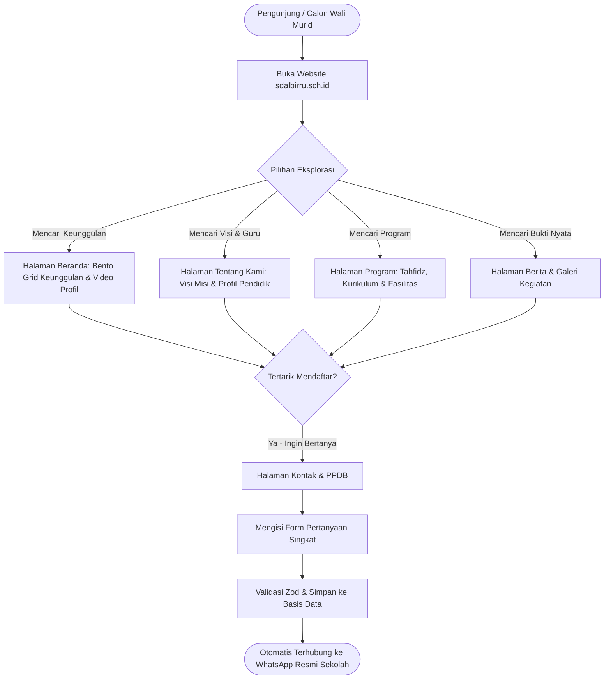
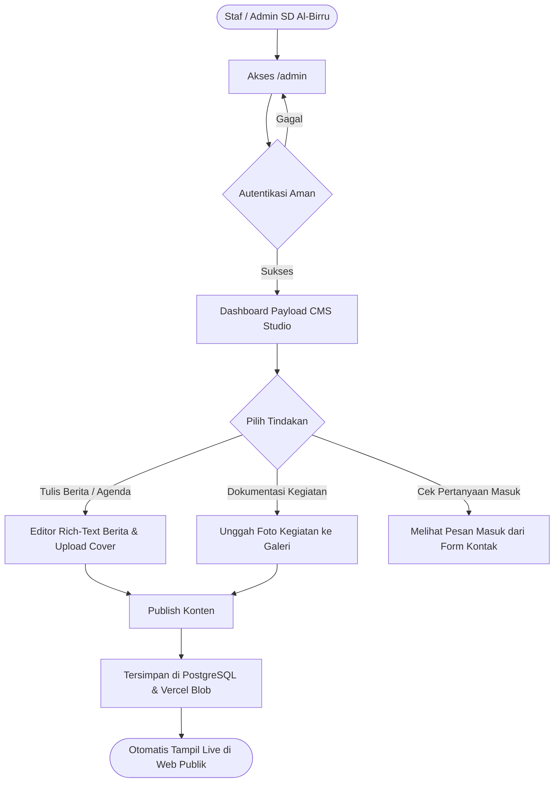
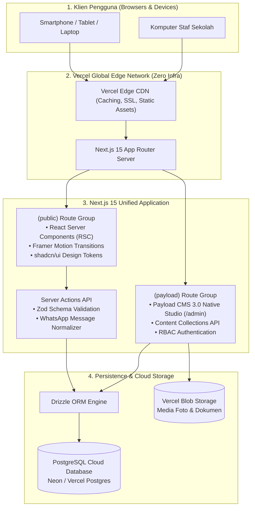
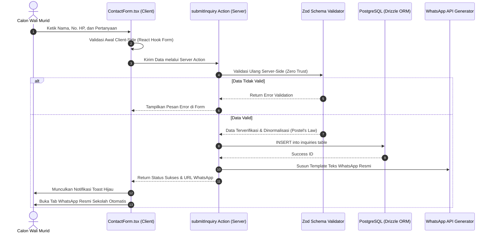

# System Architecture & Component Hierarchy
## Proyek: Website Resmi & CMS SD Al-Birru

Dokumen ini memetakan **alur kerja aplikasi (*application flow*)**, **diagram arsitektur sistem**, **hierarki komponen antarmuka**, dan **siklus data (*data flow*)** dari hulu ke hilir.

---

## 1. User Journey & Application Flow (Alur Pengguna & Sistem)

### 1.1 Alur Publik: Calon Wali Murid (Pencarian → Eksplorasi → Konversi PPDB)



---

### 1.2 Alur Admin Sekolah: Pengelolaan Konten (CMS Studio)



---

## 2. Diagram Arsitektur Sistem Terintegrasi (System Architecture)



---

## 3. Hierarki Arsitektur Komponen (Component Tree Hierarchy)

Struktur komponen disusun secara modular mematuhi kaidah **Atomic Design & Separation of Concerns**:

```text
src/
├── app/
│   ├── (public)/
│   │   ├── layout.tsx (Public Root Layout)
│   │   │   ├── Navbar.tsx (Sticky Glassmorphic Header)
│   │   │   │   ├── BrandLogo.tsx (Logo SD Al-Birru)
│   │   │   │   ├── NavLinks.tsx (Desktop Links)
│   │   │   │   ├── PPDBButton.tsx (CTA Tombol Emas)
│   │   │   │   └── MobileNav.tsx (Sheet / Mobile Drawer)
│   │   │   │
│   │   │   ├── page.tsx (Beranda / Home)
│   │   │   │   ├── HeroSection.tsx (Headline AIDA, Staggered Motion)
│   │   │   │   ├── WelcomeSection.tsx (Sambutan Kepala Sekolah)
│   │   │   │   ├── BentoValuesSection.tsx (4 Pilar Keunggulan)
│   │   │   │   ├── ProgramsPreview.tsx (Cuplikan Kurikulum & Tahfidz)
│   │   │   │   ├── LatestNewsSection.tsx (3 Kartu Berita Terkini)
│   │   │   │   ├── GalleryPreview.tsx (Slider Foto Dokumentasi)
│   │   │   │   └── CTASection.tsx (Banner Ajakan Daftar PPDB)
│   │   │   │
│   │   │   ├── about/page.tsx (Profil Sekolah)
│   │   │   │   ├── VisionMissionCard.tsx (Visi, Misi, & Tujuan)
│   │   │   │   ├── HistoryTimeline.tsx (Sejarah Singkat Al-Birru)
│   │   │   │   └── FacultyStaffGrid.tsx (Foto & Profil Dewan Guru)
│   │   │   │
│   │   │   ├── programs/page.tsx (Program & Sarana)
│   │   │   │   ├── CurriculumTabs.tsx (Kurikulum Nasional & Tahfidz)
│   │   │   │   ├── ExtracurricularGrid.tsx (Ekstrakurikuler Pilihan)
│   │   │   │   └── FacilitiesShowcase.tsx (Sarana & Prasarana)
│   │   │   │
│   │   │   ├── news/
│   │   │   │   ├── page.tsx (Arsip Berita & Pencarian)
│   │   │   │   └── [slug]/page.tsx (Detail Artikel & Tombol Share)
│   │   │   │
│   │   │   ├── gallery/page.tsx (Galeri Kegiatan & Lightbox Viewer)
│   │   │   │
│   │   │   ├── contact/page.tsx (Halaman Kontak)
│   │   │   │   ├── ContactInfoCard.tsx (Alamat, Jam Kerja, Telepon)
│   │   │   │   ├── MapEmbed.tsx (Peta Lokasi Google Maps)
│   │   │   │   └── ContactForm.tsx (Form Zod + Action WhatsApp)
│   │   │   │
│   │   │   └── Footer.tsx (Footer Institusi Resmi)
│   │   │       ├── SchoolIdentity.tsx
│   │   │       ├── QuickNavLinks.tsx
│   │   │       ├── AccreditationBadge.tsx
│   │   │       └── CopyrightNotice.tsx
│   │   │
│   │   └── (payload)/
│   │       ├── admin/[[...segments]]/page.tsx (Dashboard CMS Studio)
│   │       └── api/[[...segments]]/route.ts (Payload REST/GraphQL Endpoint)
```

---

## 4. Siklus Alur Data Formulir Kontak (*Data Lifecycle: Contact & PPDB Form*)



---

## 5. Matriks Peran & Keamanan (*Security & Access Control Matrix*)

| Tipe Pengguna | Hak Akses Rute Publik | Hak Akses Rute `/admin` | Hak Akses Basis Data |
| :--- | :--- | :--- | :--- |
| **Pengunjung Umum / Wali Murid** | Membaca seluruh halaman publik, mengisi form kontak. | ❌ Ditolak (HTTP 401 / Redirect ke Login). | ❌ Tidak ada akses langsung. |
| **Admin Konten (Staf SD Al-Birru)** | Akses penuh halaman publik. | ✅ Membaca, Menulis, dan Menyunting artikel berita, galeri, dan pesan masuk. | ✅ Akses terbatas via Payload CMS ORM. |
| **Super Admin (Pengelola IT)** | Akses penuh halaman publik. | ✅ Hak akses penuh termasuk kelola akun pengguna admin dan konfigurasi sistem. | ✅ Akses penuh terenkripsi. |

---

Dokumen arsitektur ini menjamin bahwa seluruh tim pengembang memiliki **peta navigasi teknis yang seragam, presisi, dan bebas dari kebingungan arsitektur**.
