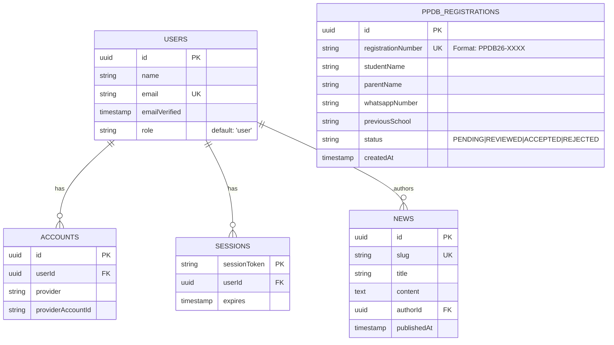

# 08: Entity Relationship Diagram (ERD)

Dokumen ini mendefinisikan skema relasional basis data secara mutlak. Skema ini dikunci menggunakan Drizzle ORM untuk menjamin *Type-Safety* 100% dari *Database* hingga *Frontend*.

## Skema Relasional Inti

## Kebijakan Kritis Basis Data
1. **Tidak Ada Penghapusan Permanen Secara Default (Soft Delete):** Data kritis seperti `PPDB_REGISTRATIONS` dilarang dihapus dari tabel utama kecuali secara hukum diharuskan.
2. **Ketergantungan Kuat (Foreign Key Constraints):** Jika *User* dihapus, maka sesi *(Sessions)* akan terhapus berantai (`Cascade`), namun *News* hanya dikosongkan penulisnya (`Set Null`) agar artikel tidak hilang.
