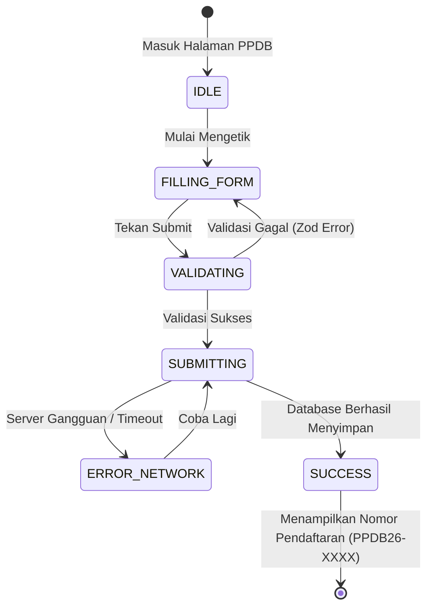

# 10: User Journey Flows & State Machines

Dalam rekayasa tingkat tinggi, antarmuka tidak boleh memiliki *state* (status) ganda yang ambigu (misalnya tombol *Submit* bisa ditekan ganda saat *loading*). Seluruh interaksi pengguna (*User Journey*) dipetakan secara matematis menggunakan model *Finite State Machine (FSM)*.

## State Machine: Pendaftaran PPDB (Admissions)

## Kebijakan Interaksi Kesalahan (Error Handling Policy)
1. **Larangan Blank Putih (Zero Blank Screen):** Apabila terjadi kegagalan sistem pada tingkat terendah sekalipun, UI wajib melempar *Error Boundary* yang elegan dan dapat dibaca manusia (bukan *stack trace* kode).
2. **Pencegahan Mutasi Ganda (Idempotency):** Saat pengguna masuk ke status `SUBMITTING`, tombol pendaftaran otomatis dilumpuhkan sementara (*disabled*) untuk mencegah data ganda akibat pengguna menekan berulang kali.
